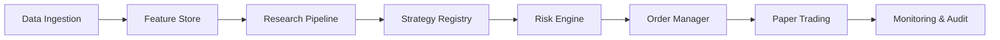

# MVP_POC_PLAN - quantum_x

## 目标
- 用最小闭环验证研究 → 回测 → 模拟盘 → 监控审计的端到端可用性
- 建立策略门禁与执行一致性基线
- 形成可重复迭代的 PoC 骨架

## 范围与假设（可覆盖）
- MVP 仅模拟盘，不接入实盘
- 单一资产域优先（默认：虚拟币现货/永续）
- 使用公开/免费数据源，付费数据后置
- 内部使用，不开放客户跟单

## Out of Scope
- 实盘交易
- 客户跟单
- 收益承诺

## PoC 架构切面

## 工作包与交付
1. 数据基线
   - 数据接入契约、标准化与质量门禁
   - 交付：数据快照、质量报告
2. 特征仓库
   - 在线/离线一致性、特征版本
   - 交付：特征版本与依赖图
3. 研究流水线
   - 实验可复现与模型/策略注册
   - 交付：实验记录、模型/策略版本
4. 策略 MVP
   - 基准策略（趋势/均值回归二选一）
   - 交付：回测报告与门禁评审记录
5. 执行一致性
   - 统一订单契约模拟盘执行
   - 交付：模拟盘执行日志
6. 风控与监控
   - 事前/事中/事后风控与审计
   - 交付：风控触发记录与审计链路

## 验收标准
- 策略通过泄漏/成本/压力测试门禁
- 回测与模拟盘偏差在阈值内
- 风控与审计链路端到端可用

## 测试与证据
- 使用 `doc/10_features/*/test_plan.md` 中的关键测试
- 记录执行证据到 `doc/00_project/initiative_quantum_x/notes.md`

## 决策门禁（必须确认）
- 资产优先级与合规地区
- 数据预算与延迟要求
- 交易通道与接入约束
- 风险限额与资金分配策略
