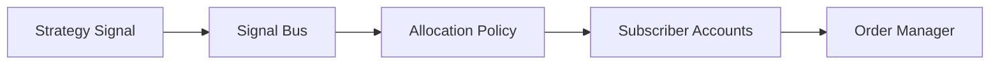

# Copy Trading Design

## 目标
- 可审计的信号分发与订阅
- 可控的风险隔离与仓位限制
- 公平透明的分配机制

## 信号分发

## 复制规则
- Per-client risk profile and max exposure
- Signal version binding and rollback
- Latency-aware allocation

## 风险隔离
- Account-level limits and stop-loss
- Strategy-level kill switch
- Emergency halt with audit log

## 审计与合规
- Signal versioning and change logs
- Allocation decision trace
- Client disclosure templates
