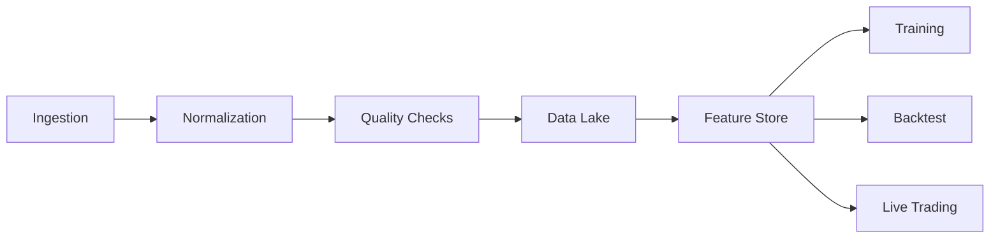

# Data Platform Design

## 目标
- 覆盖股票/期货/虚拟币的统一数据接入与标准化
- 数据版本化与可追溯，支持研究与实盘一致性
- 特征工程与特征仓库统一管理

## 数据分类
| 类型 | 示例 | 频率 | 关键要求 |
|---|---|---|---|
| Market | OHLCV, Order Book, Trades | Tick/Second/Min | Low latency, completeness |
| Derivatives | Funding, Open Interest | Min/Hour | Exchange accuracy |
| Fundamental | Financials, Corporate Actions | Daily/Quarter | Correctness, adjustments |
| Alt | News, Sentiment | Minute/Day | Source audit |

## 数据契约
- 统一时间戳、时区、资产标识
- 统一缺失值策略与异常值标记
- 统一数据版本号与变更日志

## 处理流水线

## 质量与版本控制
- 自动检测缺失率、异常值、跳变
- 重要数据源建立双源校验
- 每日数据快照与版本号

## 特征仓库
- 支持实时特征与离线特征
- 特征版本与使用记录
- 特征依赖图与影响范围

## 风险与缓解
- 数据漂移：建立漂移检测与告警
- 数据延迟：关键数据流 SLA 与缓冲策略
