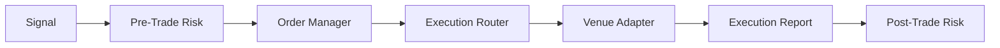

# Execution & Risk Design

## 目标
- 回测/实盘执行接口一致
- 风控入口强制统一
- 低延迟与稳定性优先

## 订单生命周期

## 风控层级
- Pre-Trade: exposure, leverage, order size, blacklist
- In-Trade: slippage, reject/timeout, cancel policies
- Post-Trade: PnL, drawdown, anomaly detection

## Kill Switch
- Trigger on abnormal latency, large drawdown, or data outage
- Manual override with audit trail

## 监控与审计
- Latency P95/P99
- Rejection rate and fill ratio
- Risk trigger logs
