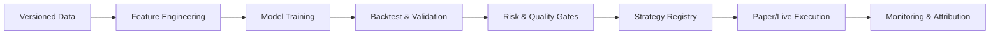

# Strategy System Design

## 目标
- 支持多策略类型与多资产统一管理
- 研究到生产一体化流水线
- 策略可审计、可回滚、可复现

## 策略类型
- Trend / Mean Reversion / Statistical Arbitrage
- Event Driven / Market Making / Cross-Asset
- Factor Models / ML / RL / Ensemble

## 研究到生产流水线

## 策略模板与组件
- Signal Generator: alpha signals
- Portfolio Constructor: weights and constraints
- Execution Policy: order style and timing
- Risk Overlay: drawdown and exposure controls

## 评审门禁（关键）
- Leakage Check (time split, forward-looking)
- Transaction Cost Sensitivity
- Stress Test (regime & tail events)
- Backtest vs Live Parity Threshold

## 版本与治理
- Strategy Registry with semantic versioning
- Approval workflow and audit logs
- Immutable backtest reports

## 核心指标
- Sharpe / IR / Max Drawdown
- Turnover / Slippage / Cost
- Live vs Backtest deviation
